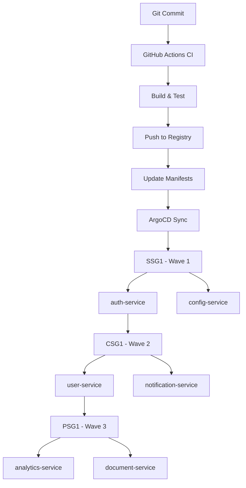
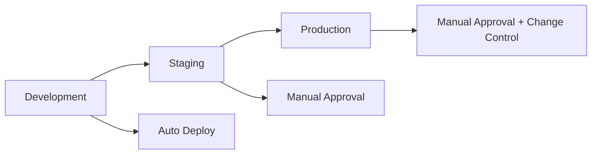

# Deployment Guide

## Overview

The Authentication Service is deployed using GitOps with ArgoCD across multiple environments. As a **SSG1** service with **Sync Wave 1**, it's one of the first services deployed in any environment.

## Deployment Architecture

### Site Group Deployment Flow



## Environments

### Development Environment

- **Namespace**: `auth-dev`
- **URL**: https://auth-dev.conga.com
- **Database**: PostgreSQL (dev instance)
- **Cache**: Redis (dev instance)
- **Replicas**: 1
- **Resources**: 
  - CPU: 100m-500m
  - Memory: 128Mi-512Mi

### Staging Environment

- **Namespace**: `auth-staging`
- **URL**: https://auth-staging.conga.com
- **Database**: PostgreSQL (staging instance)
- **Cache**: Redis (staging instance)
- **Replicas**: 2
- **Resources**:
  - CPU: 200m-1000m
  - Memory: 256Mi-1Gi

### Production Environment

- **Namespace**: `auth-prod`
- **URL**: https://auth.conga.com
- **Database**: PostgreSQL (production cluster)
- **Cache**: Redis (production cluster)
- **Replicas**: 3
- **Resources**:
  - CPU: 500m-2000m
  - Memory: 512Mi-2Gi

## ArgoCD Applications

### Development Application

```yaml
apiVersion: argoproj.io/v1alpha1
kind: Application
metadata:
  name: auth-service-dev
  namespace: argocd
spec:
  project: default
  source:
    repoURL: https://github.com/testorg08/auth-service
    targetRevision: main
    path: k8s/overlays/dev
  destination:
    server: https://kubernetes.default.svc
    namespace: auth-dev
  syncPolicy:
    automated:
      prune: true
      selfHeal: true
    syncOptions:
      - CreateNamespace=true
  syncWave: 1
```

## Infrastructure Dependencies

### PostgreSQL Database

The service requires a PostgreSQL database with the following configuration:

```yaml
# Database Schema
CREATE DATABASE auth_db;
CREATE USER auth_user WITH PASSWORD 'secure_password';
GRANT ALL PRIVILEGES ON DATABASE auth_db TO auth_user;

# Required Tables
- users
- sessions  
- roles
- permissions
- audit_logs
```

### Redis Cache

Redis is used for session storage and rate limiting:

```yaml
# Redis Configuration
maxmemory: 256mb
maxmemory-policy: allkeys-lru
timeout: 300
```

## Deployment Process

### 1. Code Changes

1. Developer makes changes to the auth-service
2. Creates pull request to main branch
3. CI pipeline runs tests and builds container
4. After merge, container is pushed to registry

### 2. GitOps Deployment

1. ArgoCD detects changes in Git repository
2. Syncs changes to target environment
3. Kubernetes applies manifests in sync wave order
4. Health checks validate deployment success

### 3. Environment Promotion



## Configuration Management

### Environment Variables

| Variable | Description | Dev | Staging | Production |
|----------|-------------|-----|---------|------------|
| `DATABASE_URL` | PostgreSQL connection string | ✓ | ✓ | ✓ |
| `REDIS_URL` | Redis connection string | ✓ | ✓ | ✓ |
| `JWT_SECRET` | JWT signing secret | ✓ | ✓ | ✓ |
| `LOG_LEVEL` | Logging level | debug | info | warn |
| `RATE_LIMIT_ENABLED` | Enable rate limiting | false | true | true |

### Secrets Management

Secrets are managed using Kubernetes secrets and external secret operators:

```yaml
apiVersion: v1
kind: Secret
metadata:
  name: auth-service-secrets
type: Opaque
data:
  database-password: <base64-encoded>
  jwt-secret: <base64-encoded>
  redis-password: <base64-encoded>
```

## Monitoring and Health Checks

### Health Endpoints

- **Liveness**: `/health/live` - Service is running
- **Readiness**: `/health/ready` - Service is ready to accept traffic
- **Startup**: `/health/startup` - Service has started successfully

### Metrics

Prometheus metrics are exposed at `/metrics`:

- `auth_requests_total` - Total authentication requests
- `auth_requests_duration_seconds` - Request duration histogram
- `auth_active_sessions` - Number of active sessions
- `auth_failed_logins_total` - Failed login attempts

### Alerts

Key alerts configured in Prometheus:

```yaml
# High error rate
- alert: AuthServiceHighErrorRate
  expr: rate(auth_requests_total{status=~"5.."}[5m]) > 0.1
  
# Service down
- alert: AuthServiceDown
  expr: up{job="auth-service"} == 0
  
# High response time
- alert: AuthServiceHighLatency
  expr: histogram_quantile(0.95, rate(auth_requests_duration_seconds_bucket[5m])) > 1
```

## Rollback Procedures

### Automatic Rollback

ArgoCD can automatically rollback failed deployments:

```yaml
syncPolicy:
  automated:
    prune: true
    selfHeal: true
  retry:
    limit: 3
    backoff:
      duration: 5s
      factor: 2
      maxDuration: 3m
```

### Manual Rollback

```bash
# Rollback to previous version
kubectl rollout undo deployment/auth-service -n auth-prod

# Rollback to specific revision
kubectl rollout undo deployment/auth-service --to-revision=2 -n auth-prod

# Check rollout status
kubectl rollout status deployment/auth-service -n auth-prod
```

## Troubleshooting

### Common Issues

1. **Database Connection Issues**
   - Check database connectivity
   - Verify credentials in secrets
   - Check network policies

2. **Redis Connection Issues**
   - Verify Redis service is running
   - Check Redis authentication
   - Validate connection string

3. **High Memory Usage**
   - Check for memory leaks
   - Review session storage
   - Monitor garbage collection

### Debugging Commands

```bash
# Check pod status
kubectl get pods -n auth-prod -l app=auth-service

# View logs
kubectl logs -f deployment/auth-service -n auth-prod

# Check service endpoints
kubectl get endpoints auth-service -n auth-prod

# Port forward for local testing
kubectl port-forward svc/auth-service 8080:80 -n auth-prod
```

## Security Considerations

### Network Policies

```yaml
apiVersion: networking.k8s.io/v1
kind: NetworkPolicy
metadata:
  name: auth-service-netpol
spec:
  podSelector:
    matchLabels:
      app: auth-service
  policyTypes:
  - Ingress
  - Egress
  ingress:
  - from:
    - namespaceSelector:
        matchLabels:
          name: ingress-nginx
  egress:
  - to:
    - namespaceSelector:
        matchLabels:
          name: database
```

### Pod Security Standards

```yaml
apiVersion: v1
kind: Pod
spec:
  securityContext:
    runAsNonRoot: true
    runAsUser: 1000
    fsGroup: 2000
  containers:
  - name: auth-service
    securityContext:
      allowPrivilegeEscalation: false
      readOnlyRootFilesystem: true
      capabilities:
        drop:
        - ALL
```

## Support

For deployment issues:
- **Team**: Platform Team
- **Email**: platform-team@conga.com
- **Runbook**: [Internal Runbook Link]
- **On-call**: PagerDuty escalation