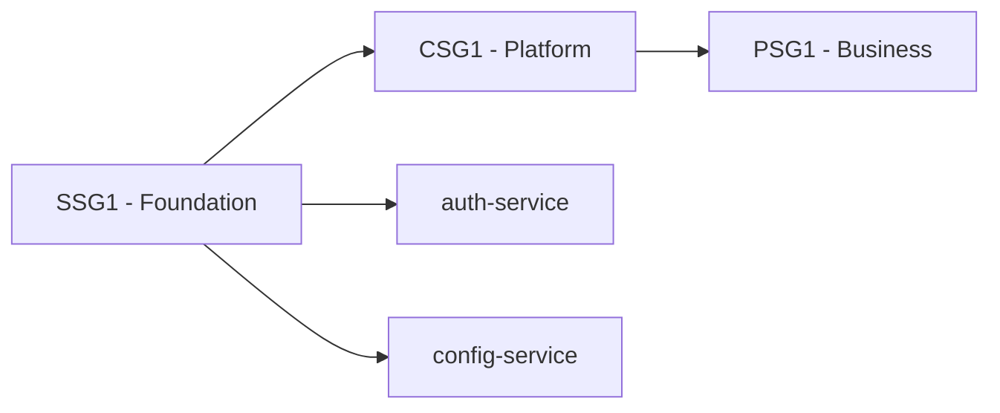

# Conga Authentication Service

## Overview

The Authentication Service is the foundational security component of the Conga Platform, providing centralized authentication and authorization capabilities for all Conga services and applications.

## Key Features

- **JWT-based Authentication**: Secure token-based authentication using JSON Web Tokens
- **Multi-factor Authentication**: Support for MFA including TOTP and SMS
- **Role-based Access Control**: Granular permissions and role management
- **Session Management**: Secure session handling with configurable timeouts
- **Audit Logging**: Comprehensive security event logging
- **SSO Integration**: Support for SAML and OAuth providers

## Architecture

The Authentication Service is deployed as part of the **SSG1 (Site Group 1)** with **Sync Wave 1**, making it one of the first services to be deployed in any environment.

### Dependencies

- **Database**: PostgreSQL for user data and session storage
- **Cache**: Redis for session caching and rate limiting
- **Message Queue**: RabbitMQ for audit event processing

### Site Group Deployment



## Service Information

| Property | Value |
|----------|-------|
| **Service Name** | auth-service |
| **Site Group** | SSG1 |
| **Sync Wave** | 1 |
| **Owner** | Platform Team |
| **Lifecycle** | Production |
| **Type** | Service |

## Infrastructure Requirements

- **PostgreSQL Database**: Primary data storage
- **Redis Cache**: Session and rate limiting cache
- **Load Balancer**: High availability and traffic distribution
- **SSL Certificates**: TLS termination and encryption

## Environments

| Environment | URL | Purpose |
|-------------|-----|---------|
| **Development** | https://auth-dev.conga.com | Development and testing |
| **Staging** | https://auth-staging.conga.com | Pre-production validation |
| **Production** | https://auth.conga.com | Live production service |

## Quick Start

### Authentication Flow

1. **Login**: POST `/api/v1/auth/login` with credentials
2. **Receive Tokens**: Get access and refresh tokens
3. **Use Token**: Include `Authorization: Bearer <token>` in requests
4. **Refresh**: Use refresh token to get new access token
5. **Logout**: POST `/api/v1/auth/logout` to invalidate session

### Example Usage

```bash
# Login
curl -X POST https://auth.conga.com/api/v1/auth/login \
  -H "Content-Type: application/json" \
  -d '{"email": "user@conga.com", "password": "password"}'

# Validate token
curl -X POST https://auth.conga.com/api/v1/auth/validate \
  -H "Authorization: Bearer <your-token>"
```

## Security Considerations

- All passwords are hashed using bcrypt with salt
- JWT tokens have configurable expiration times
- Rate limiting is enforced on all authentication endpoints
- All authentication events are logged for audit purposes
- MFA is required for administrative accounts

## Monitoring and Alerts

- **Health Check**: `/health` endpoint for service monitoring
- **Metrics**: Prometheus metrics for authentication rates and errors
- **Alerts**: Configured for failed login attempts and service downtime
- **Logs**: Structured logging with correlation IDs

## Support

For issues or questions regarding the Authentication Service:

- **Team**: Platform Team
- **Email**: platform-team@conga.com
- **Slack**: #platform-team
- **On-call**: PagerDuty escalation policy